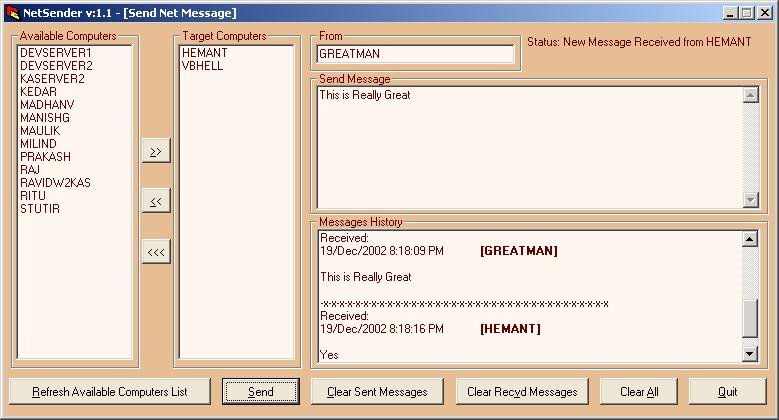

<div align="center">

## NetSender \(Cute GUI To Send and Receive Net Send Messages\)


</div>

### Description

NetSender v:1.1               Designed and Developed By Anup Jishnu (AnupJishnu@hotmail.com)

Cute GUI to send and receive Net Send Messages.                         Features of NetSender

1. A list of computers, to which you can send messages to.

2. Select multiple computers to whom the net send message has to be sent.

3. The other computer need not have this application running. The user on a machine without NetSender will receive the messages as normal Net Send Message and can send message to you via the normal Net Send command.

4. Sits in the System Tray.

5. No more annoying and disturbing popups of net send messages. System Tray Icon flashes when new messages arrive.

6. Stores all the messages received and sent in the message box.

7. Reply to a message received by double clicking on the sender name.

8. Send large data, NetSender automatically breaks up the large message into smaller parts and send them.

Please Note:

NetSender currently will work only for Windows NT, 2000 and XP.

It will not work for Win 9x.

I need help from you guys find code to make NetSender work in Win 9x.                                    I thank all the developers who provided sample code for many features at Planet-Source-Code.
 
### More Info
 


<span>             |<span>
---                |---
**Submitted On**   |2002-12-19 20:22:48
**By**             |[The VB Guru \(Anup Jishnu\)](https://github.com/Planet-Source-Code/PSCIndex/blob/master/ByAuthor/the-vb-guru-anup-jishnu.md)
**Level**          |Advanced
**User Rating**    |4.5 (76 globes from 17 users)
**Compatibility**  |VB 5\.0, VB 6\.0
**Category**       |[Complete Applications](https://github.com/Planet-Source-Code/PSCIndex/blob/master/ByCategory/complete-applications__1-27.md)
**World**          |[Visual Basic](https://github.com/Planet-Source-Code/PSCIndex/blob/master/ByWorld/visual-basic.md)
**Archive File**   |[NetSender\_15160412202002\.zip](https://github.com/Planet-Source-Code/the-vb-guru-anup-jishnu-netsender-cute-gui-to-send-and-receive-net-send-messages__1-41736/archive/master.zip)

### API Declarations

```
Public Declare Function NetMessageBufferSend Lib "Netapi32" (ByVal sServerName$, ByVal sMsgName$, ByVal sFromName$, ByVal sMessageText$, ByVal lBufferLength&) As Long
'The NetMessageBufferSend function's first four parameters take Unicode strings. _
The first parameter contains the name of the server on which the function will be _
executed. The second parameter contains the message recipient's name. The third _
parameter contains the message sender's name. The fourth parameter contains the _
text of the message to be sent. The fifth parameter, a long integer, identifies _
the length of the message to be sent.
'Because the NetMessageBufferSend function is declared in a DLL, all the string _
parameters are declared with the ByVal keyword. Although ByVal ordinarily causes _
VB to pass a parameter's value, this keyword works differently for passing _
string parameters to an external DLL such as netapi32.dll. Using ByVal to pass _
strings to functions contained in external DLLs causes VB to convert the strings _
from VB string format into the C string format required by most DLLs, including _
netapi32.dll. The fifth parameter also uses the ByVal keyword, but because this _
parameter contains a numeric variable and not a string, ByVal works as you'd _
expect: It causes VB to pass the value of the numeric variable, rather than _
passing a pointer to the variable.
```


